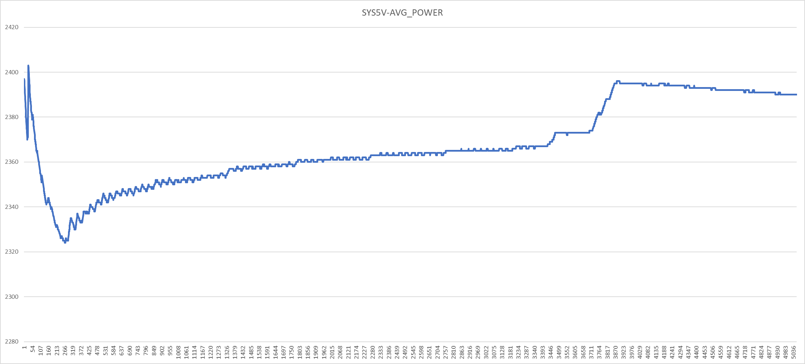
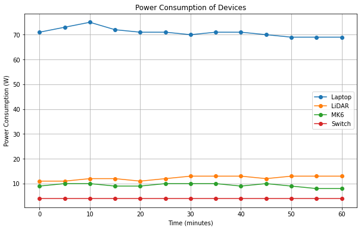

# Introduction

Power consumption can be measured via hardware or software on most jetson devices via the Nvidia power manager. Measuring power via hardware will have the most accurate measurements.

## Datasheet consumption

These values were taken from the datasheets or power adapter outputs of the devices.

| Device                        | Type      | Consumption   |
|-------------------------------|-----------|---------------|
| Nvidia Jetson AGX Xavier H01  | Computer  |   <30w        |
| Cepton Vista P60              | LiDAR     |   10w         |
| Intel Realsense D455          | Camera    |   4w          |
| Garmin 18x LVC                | GPS       |   0.5w        |
| Cohda MK6                     | Tranceiver|   12w         |
| Network switch                | Switch    |   4w          |

## Measured consumption

Two types of tests were done with the devices. A software based measurement for the compute device only, and a hardware based measurement for a view of the whole system. 

### Software
The software based measurement only measures power consumption within the Jetson device itself. It was recorded from the Nvidia power monitor during a truck data collection drive  This should be bounded within the 30w datasheet limit and reflect the processing demand as data is collected. 

### Hardware

The hardware mesurements were taken over a 1 hour

##### Recorded values  
laptop = [71, 73, 75, 72, 71, 71, 70, 71, 71, 70, 69, 69, 69]  
lidar    = [11, 11, 12, 12, 11, 12, 13, 13, 13, 12, 13, 13, 13]  
mk6    = [9, 10, 10, 9, 9, 10, 10, 10, 9, 10, 9, 8, 8]  
switch = [4, 4, 4, 4, 4, 4, 4, 4, 4, 4, 4, 4, 4]  

